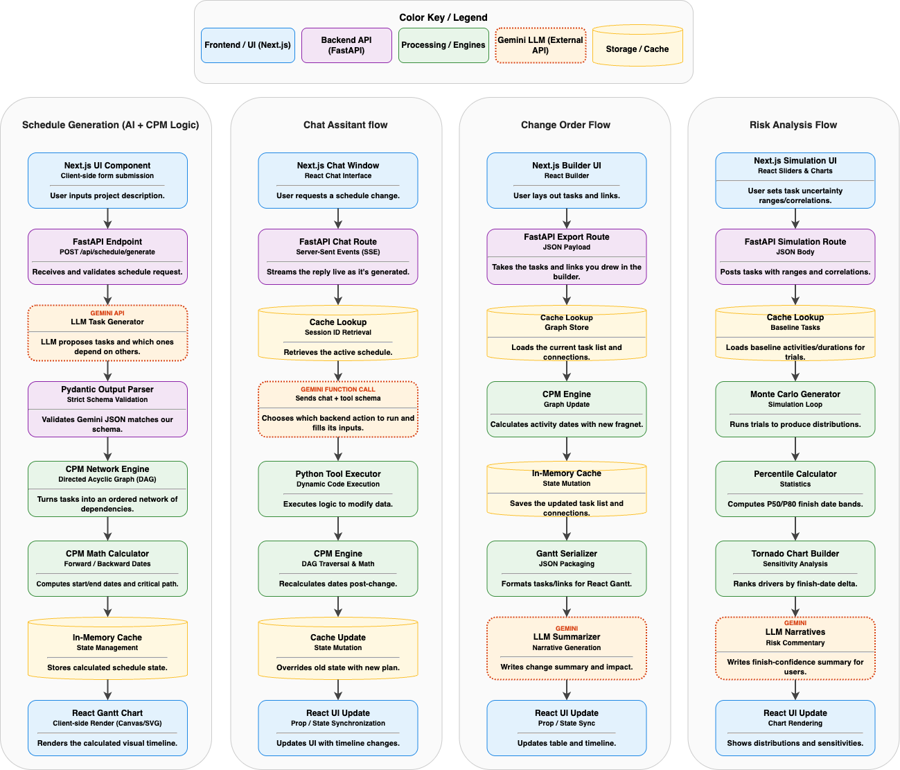

# Karmen Playground

An interactive, zero-sign-up demo of AI-powered construction scheduling. Select a project and the full demo is live in seconds.

Built as a portfolio piece for the [Karmen](https://karmen.ai) founding team (YC F24).

**[View Live Demo](https://karmen-playground.vercel.app)**

---

## What It Does

### Schedule Builder
AI generates a full CPM schedule from plain-text scope descriptions. Edit activities through natural language chat ("push drywall back two weeks", "add a concrete curing task after foundations") and watch the Gantt chart update in real time. Critical path highlighting, dependency arrows, and interactive tooltips included.

### Change Order Simulator
Select a pre-built change order and instantly see its impact. The engine deep-copies the schedule, inserts the fragnet (new activities, modified durations, shifted dependencies), re-runs CPM, and computes the delta. An animated before/after Gantt comparison shows exactly what changed, with an LLM-generated impact narrative explaining the delay in plain English.

### Risk Analysis Dashboard
The headline feature. Run a 10,000-iteration Monte Carlo simulation using PERT Beta distributions across every activity. Get P50, P80, and P95 completion confidence dates, a probability histogram, and a Spearman correlation tornado chart that ranks which activities drive the most schedule risk.

---

## System Design

<p align="center">
  
</p>

---

## Tech Stack

| Layer | Technology |
|-------|-----------|
| Frontend | Next.js 14 (App Router), TypeScript, Tailwind CSS, Framer Motion, Recharts |
| Backend | Python 3.11, FastAPI, Pydantic v2, Uvicorn |
| LLM | Google Gemini 2.5 Flash + Flash-Lite |
| CPM Engine | NetworkX (forward/backward pass, FS/SS/FF/SF dependencies with lag) |
| Monte Carlo | NumPy (PERT Beta sampling, 10K vectorized iterations), SciPy (Spearman correlation) |
| Storage | In-memory cache + JSON seed data (no database) |
| Deployment | [Vercel](https://vercel.com) (frontend) + [Railway](https://railway.app) (backend) |

---

## Running Locally

### 1. Clone

```bash
git clone https://github.com/rehanmollick/karmen-playground.git
cd karmen-playground
```

### 2. Backend

```bash
cd backend
python3 -m venv .venv && source .venv/bin/activate
pip install -r requirements.txt
```

Create `backend/.env`:
```bash
GEMINI_API_KEY=<your key from Google AI Studio - free tier>
FRONTEND_URL=http://localhost:3000
RATE_LIMIT_PER_HOUR=10
CACHE_TTL_SECONDS=3600
```

Start the server:
```bash
uvicorn app.main:app --reload
```

### 3. Frontend

```bash
cd frontend
npm install
```

Create `frontend/.env.local`:
```bash
NEXT_PUBLIC_API_URL=http://localhost:8000
```

Start the dev server:
```bash
npm run dev
```

Open [http://localhost:3000](http://localhost:3000).

---

## Seed Projects

| Project | Activities | Duration |
|---------|-----------|----------|
| Lakewood Residence -- 3-Story Custom Home | 39 | ~180 days |
| Summit Office -- Commercial Tenant Improvement | 35 | ~98 days |
| Cedar Creek Bridge -- Highway Bridge Replacement | 39 | ~285 days |

Each project includes 3 pre-loaded change orders with realistic fragnet data.

---

## Disclaimer

This is a portfolio demo project. It is not affiliated with, endorsed by, or connected to Karmen in any way. AI-generated schedules are for demonstration purposes only and should not be used for actual construction project planning.

---

Built by [Rehan Mollick](https://linkedin.com/in/rehanmollick)
