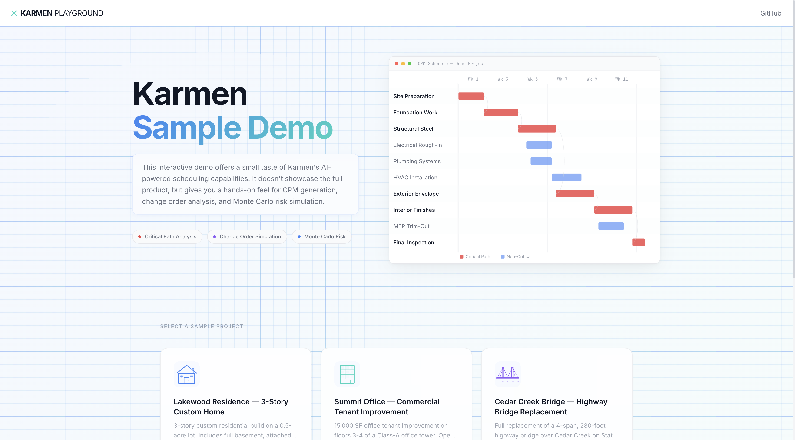
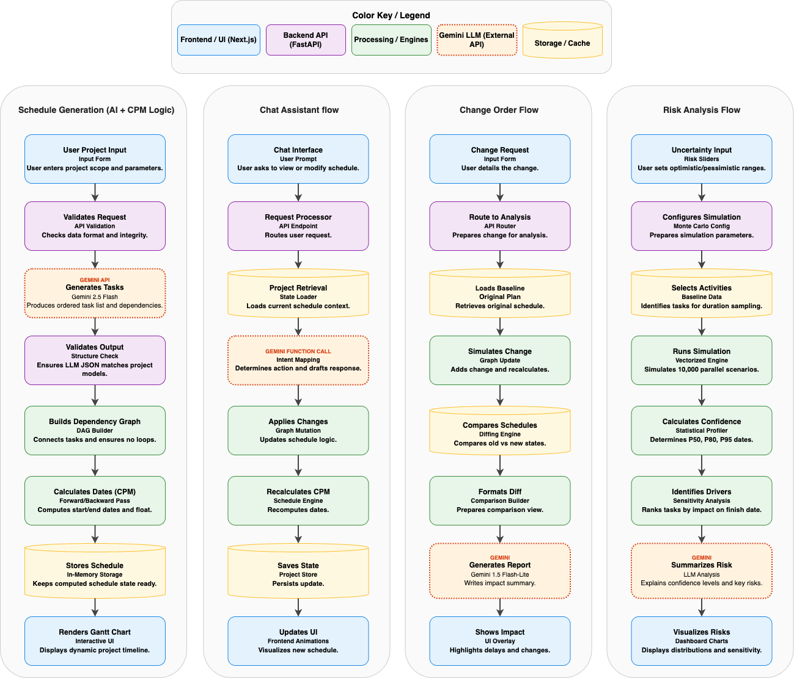

<p align="center">
  An interactive demo of a construction scheduler with smart LLM integration.<br/>
  Start by going to this <strong><a href="https://karmen-playground.vercel.app">Live Demo</a></strong>.
</p>


<p align="center">
  
</p>


<p align="center">
   Built as a portfolio piece for the <a href="https://karmen.ai">Karmen</a> founding team (YC F24)
</p>


---

## What It Does

> **Schedule Builder** -- Describe your project scope in plain text. AI generates a full CPM schedule with activities, dependencies, and a Gantt chart. Edit it with natural language ("push drywall back two weeks", "add concrete curing after foundations") and the schedule recomputes live. Critical path highlighting, dependency arrows, and interactive tooltips included.

> **Change Order Simulator** -- Select a change order and instantly see the ripple effect. The engine deep-copies the schedule, injects the fragnet (new activities, modified durations, shifted dependencies), re-runs CPM, and surfaces the delta. An animated before/after Gantt comparison shows exactly what moved, paired with an LLM-generated impact narrative explaining the delay in plain English.

> **Risk Analysis Dashboard** -- The headline feature. 10,000-iteration Monte Carlo simulation with PERT Beta distributions across every activity. P50/P80/P95 completion confidence dates, a probability histogram, and a Spearman correlation tornado chart ranking which activities drive the most schedule risk.

---

## System Design

<p align="center">
  
</p>

---

## Tech Stack

| Layer | Technology |
|-------|-----------|
| Frontend | Next.js 14 (App Router), TypeScript, Tailwind CSS, Framer Motion, Recharts |
| Backend | Python 3.11, FastAPI, Pydantic v2, Uvicorn |
| LLM | Google Gemini 2.5 Flash + Flash-Lite |
| CPM Engine | NetworkX (forward/backward pass, FS/SS/FF/SF dependencies with lag) |
| Monte Carlo | NumPy (PERT Beta sampling, 10K vectorized iterations), SciPy (Spearman correlation) |
| Storage | In-memory cache + JSON seed data (no database) |
| Deployment | [Vercel](https://vercel.com) (frontend) + [Railway](https://railway.app) (backend) |

---

## Running Locally

### 1. Clone

```bash
git clone https://github.com/rehanmollick/karmen-playground.git
cd karmen-playground
```

### 2. Backend

```bash
cd backend
python3 -m venv .venv && source .venv/bin/activate
pip install -r requirements.txt
```

Create `backend/.env`:
```bash
GEMINI_API_KEY=<your key from Google AI Studio - free tier>
FRONTEND_URL=http://localhost:3000
RATE_LIMIT_PER_HOUR=10
CACHE_TTL_SECONDS=3600
```

Start the server:
```bash
uvicorn app.main:app --reload
```

### 3. Frontend

```bash
cd frontend
npm install
```

Create `frontend/.env.local`:
```bash
NEXT_PUBLIC_API_URL=http://localhost:8000
```

Start the dev server:
```bash
npm run dev
```

Open [http://localhost:3000](http://localhost:3000).

---

## Seed Projects

| Project | Activities | Duration |
|---------|-----------|----------|
| Lakewood Residence -- 3-Story Custom Home | 39 | ~180 days |
| Summit Office -- Commercial Tenant Improvement | 35 | ~98 days |
| Cedar Creek Bridge -- Highway Bridge Replacement | 39 | ~285 days |

Each project includes 3 pre-loaded change orders with realistic fragnet data.

---

## Disclaimer

This is a portfolio demo project. It is not affiliated with, endorsed by, or connected to Karmen in any way. AI-generated schedules are for demonstration purposes only and should not be used for actual construction project planning.

---

Built by [Rehan Mollick](https://linkedin.com/in/rehanmollick)
